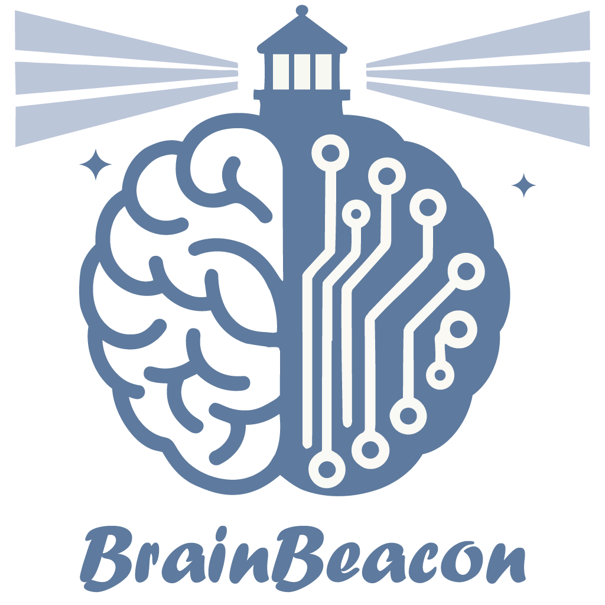

# BrainBeacon

<p align="center">
  
</p>

[![Tests][badge-tests]][tests]
[![Documentation][badge-docs]][documentation]

[badge-tests]: https://img.shields.io/github/actions/workflow/status/ChengmingZhang-CAS/BrainBeacon/test.yaml?branch=main
[badge-docs]: https://img.shields.io/readthedocs/BrainBeacon

*🧠 A cross-species foundation model for single-cell–resolved brain spatial transcriptomics*


## Overview

Understanding the brain’s cellular architecture across species is fundamental to neuroscience, yet spatial transcriptomics data remain highly fragmented across organisms and technologies. BrainBeacon addresses this challenge by introducing a cross-species foundation model trained on a large-scale spatial brain atlas (BrainST-133M), comprising over 133 million spatially resolved cells from whole brains of human, macaque, marmoset, and mouse across multiple spatial transcriptomics platforms.

BrainBeacon adopts a dual-stage transformer architecture to learn unified molecular–spatial representations by jointly modeling intra-cellular gene expression organization and inter-cellular spatial interactions. The learned representations support zero-shot spatial clustering and can be fine-tuned for downstream tasks such as cross-species label transfer and in silico niche perturbation, including gene-driven perturbation (GNP) and cell-driven niche perturbation (CNP).

<p align="center">
  
</p>

**Overview of the BrainBeacon framework and downstream applications.**  
The framework integrates large-scale cross-species spatial brain atlases with a structured tokenization of spatial transcriptomics data, capturing sample metadata, intra-cell gene-rank information, and inter-cell spatial cues derived from local neighborhoods. A dual-stage transformer architecture models gene-level relations within cells and spatial dependencies among cells within tissue slices, enabling diverse downstream applications including spatial clustering, annotation, cross-species label transfer, and in silico niche perturbation.


## Installation

BrainBeacon is currently available as a development version from GitHub.

You need to have **Python 3.10 or newer** installed on your system. We recommend installing BrainBeacon in a clean virtual environment to avoid dependency conflicts.

Install the latest development version:

```bash
pip install git+https://github.com/ChengmingZhang-CAS/BrainBeacon.git@main
```

(Optional) For local development:

```bash
git clone https://github.com/ChengmingZhang-CAS/BrainBeacon.git
cd BrainBeacon
pip install -e .
```


## Documentation

Documentation is available at:
[https://BrainBeacon.readthedocs.io](https://BrainBeacon.readthedocs.io)

Tutorials and examples will be expanded.


## Data and Pretrained Weights

### Data overview

A summary of the spatial transcriptomics datasets used for training and evaluation is provided as a tabulated overview, including species, platforms, and cell counts.
Detailed dataset statistics are available in the repository as a standalone table file.

The full training and evaluation datasets are not included in this repository.

### Pretrained weights

Pretrained model weights and checkpoints can be downloaded from this Google Drive folder: https://drive.google.com/drive/folders/11d2xn1ZysKiqmjVEy_H8GAaT-GDwuERL?usp=drive_link

This folder contains the following three files:

	•	cellformer.config.json
	•	epoch_0_step_8000000.pt
	•	cellformer_epoch99.pt


## Citation

If you use BrainBeacon in your work, please cite:

```txt
Zhang, C., Yang, Y., et al. BrainBeacon: A cross-species foundation model for single-cell resolved brain spatial transcriptomics.
bioRxiv (2025). https://doi.org/10.1101/2025.07.08.663729
        
        
```


## Contact

For questions and help requests, please open an issue on GitHub or contact the corresponding author listed in the manuscript.

[issue tracker]: https://github.com/ChengmingZhang-CAS/BrainBeacon/issues
[tests]: https://github.com/ChengmingZhang-CAS/BrainBeacon/actions/workflows/test.yaml
[documentation]: https://BrainBeacon.readthedocs.io
[changelog]: https://BrainBeacon.readthedocs.io/en/latest/changelog.html
[api documentation]: https://BrainBeacon.readthedocs.io/en/latest/api.html
